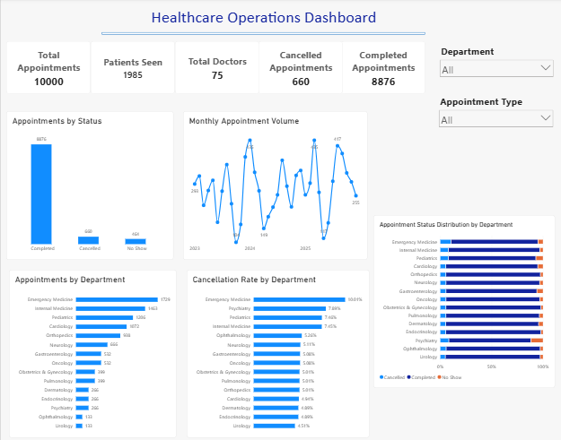
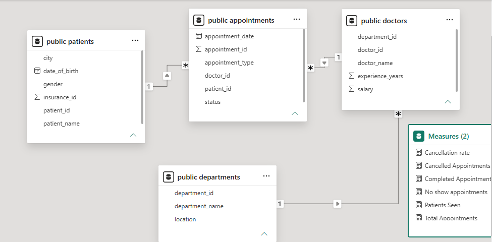

# Healthcare Operations Analytics Dashboard

## Project Overview

This project analyzes synthetic healthcare operations data stored in PostgreSQL and builds an interactive analytics dashboard in Power BI.
SQL queries were used to analyze the source data and validate the Power BI metrics and visualizations

## Tools & Technologies

- PostgreSQL
- SQL
- Power BI Desktop
- Power Query
- DAX

## Key Metrics

- Total Appointments
- Patients Seen
- Total Doctors
- Completed Appointments
- Cancelled Appointments

## Dashboard Features

- Appointment status analysis
- Monthly appointment volume trends
- Appointment volume by department
- Cancellation rate analysis by department
- Appointment status distribution by department
- Interactive filtering by department and appointment type

## SQL Validation

SQL queries were used to validate key Power BI results, including:

- Total appointments,total doctors and patients seen 
- Appointment counts by status
- Appointment volume by department
- Department cancellation rates
- Monthly appointment trends
- Slicer-filtered KPI results
- Appointment status distribution by department

## Data Model

The Power BI model uses the following relationships:

- Patients (1) → Appointments (Many)
- Doctors (1) → Appointments (Many)
- Departments (1) → Doctors (Many)

A dedicated Measures table was used to organize DAX measures used throughout the dashboard.

## Project Files

- `database_setup.sql` – PostgreSQL database structure and synthetic dataset
- `validation_queries.sql` – SQL queries used to validate dashboard metrics and visualizations
- `Healthcare_Operations_Dashboard.pbix` – Power BI dashboard
- `dashboard_overview.png` – Final dashboard screenshot
- `healthcare_data_model.png` – Power BI data model screenshot

## Dashboard Preview

## Data Model

## Project Purpose

This project demonstrates hands-on experience with SQL, PostgreSQL, Power BI, data modeling, 
DAX, dashboard development, and data validation using a healthcare operations dataset.